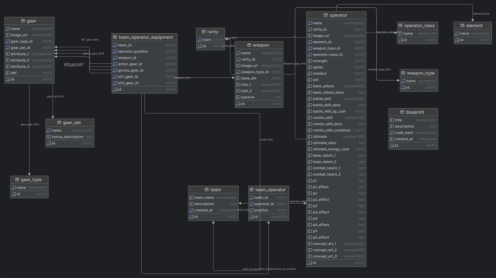

# Talos-II Archive - Backend

## Descripción General
Aplicación backend para Talos-II Archive, un sistema de gestión de contenido para el videojuego Arknights Endfield. Incluye panel administrativo web para gestionar operadores, armas y equipamiento, además de API REST para consultas.

## Requisitos para Funcionamiento
- **Java 17 o superior**
- **MySQL 8.0 o superior**
- **Gradle** (incluido wrapper en el proyecto)
- **Conexión a internet** para descargar dependencias

## Base de Datos



### Descripción de Tablas

#### Tablas de Referencia
- **weapon_type**: Tipos de armas disponibles
- **element**: Elementos de los operadores
- **operator_class**: Clases de operadores
- **rarity**: Niveles de rareza
- **gear_type**: Tipos de equipamiento
- **gear_set**: Conjuntos de equipamiento con bonificaciones

#### Tablas Principales
- **operator**: Personajes del juego con sus atributos, habilidades y estadísticas
- **weapon**: Armas con daño base, estadísticas adicionales y habilidades pasivas
- **gear**: Piezas de equipamiento con atributos y defensa
- **team**: Equipos creados por usuarios
- **blueprint**: Configuraciones compartidas de equipos

#### Tablas de Relación
- **team_operator**: Relación entre equipos y operadores (4 operadores por equipo)
- **team_operator_equipment**: Equipamiento asignado a cada operador en un equipo

### Replicar la Base de Datos en Otro Servidor

1. **Exportar desde servidor original:**
```bash
mysqldump -u usuario -p talosii_archive > backup.sql
```

2. **Crear base de datos en nuevo servidor:**
```sql
CREATE DATABASE talosii_archive;
```

3. **Importar datos:**
```bash
mysql -h nuevo_servidor -u usuario -p talosii_archive < backup.sql
```

4. **Actualizar credenciales** en `src/main/resources/application.properties`

## Configuración de Gradle

### Añadir Dependencias al build.gradle.kts

Asegúrate de incluir las siguientes dependencias en tu archivo `build.gradle.kts`:

```kotlin
dependencies {
    implementation("org.springframework.boot:spring-boot-starter-data-jpa")
    implementation("org.springframework.boot:spring-boot-starter-thymeleaf")
    implementation("org.springframework.boot:spring-boot-starter-webmvc")
    implementation("org.jetbrains.kotlin:kotlin-reflect")
    implementation("tools.jackson.module:jackson-module-kotlin")
    developmentOnly("org.springframework.boot:spring-boot-devtools")
    testImplementation("org.springframework.boot:spring-boot-starter-data-jpa-test")
    testImplementation("org.springframework.boot:spring-boot-starter-thymeleaf-test")
    testImplementation("org.springframework.boot:spring-boot-starter-webmvc-test")
    testImplementation("org.jetbrains.kotlin:kotlin-test-junit5")
    testRuntimeOnly("org.junit.platform:junit-platform-launcher")
    implementation("mysql:mysql-connector-java:8.0.33")
}
```

## Cómo Ejecutar la Aplicación

### Configuración Inicial
1. **Crear base de datos MySQL:**
```sql
CREATE DATABASE talosii_archive;
```

2. **Configurar conexión** en `src/main/resources/application.properties`:
```properties
spring.datasource.url=jdbc:mysql://localhost:3306/talosii_archive
spring.datasource.username=tu_usuario
spring.datasource.password=tu_contraseña
server.port=8080
```

### Ejecución
```bash
# Opción 1: Usando Gradle Wrapper
./gradlew bootRun

# Opción 2: Construir y ejecutar JAR
./gradlew build
java -jar build/libs/talosIIarchive-1.0.0.jar
```

### Acceso
- **Panel Administrativo:** `http://localhost:8080/endfield/admin`
- **API REST:** `http://localhost:8080/endfield/api/`

## Opciones del Programa y Ejemplos de Uso

### Panel Administrativo
1. **Dashboard:** Vista general con estadísticas del sistema
2. **Gestión de Operadores:** CRUD completo de operadores
3. **Gestión de Armas:** CRUD completo de armas
4. **Gestión de Equipamiento:** CRUD completo de equipamiento

### API REST
```bash
# Crear un nuevo equipo
curl -X POST http://localhost:8080/endfield/teams \
  -H "Content-Type: application/json" \
  -d '{
    "teamName": "Mi Equipo",
    "operatorIds": [1, 2, 3, 4],
    "weaponIds": [10, 11, 12, 13],
    "gearIds": [
      [101, 102, 103, 104],
      [105, 106, 107, 108],
      [109, 110, 111, 112],
      [113, 114, 115, 116]
    ]
  }'

# Consultar blueprints
curl http://localhost:8080/endfield/blueprints
```

### Creación de Equipos
Cada equipo debe tener:
- 4 operadores únicos
- Cada operador equipado con:
  - 1 arma compatible
  - 1 armadura
  - 1 guantes
  - 2 kits diferentes
- Se calculan automáticamente las bonificaciones de set (activadas con 3+ piezas del mismo set)

## Notas Importantes

1. **Puerto:** La aplicación se ejecuta en el puerto 8080 por defecto. Cambiar en `application.properties` si es necesario.

2. **Proyecto Académico:** Esta aplicación es para fines educativos y de demostración.

3. **Seguridad:** No incluye sistema de autenticación/autorización en esta versión.
